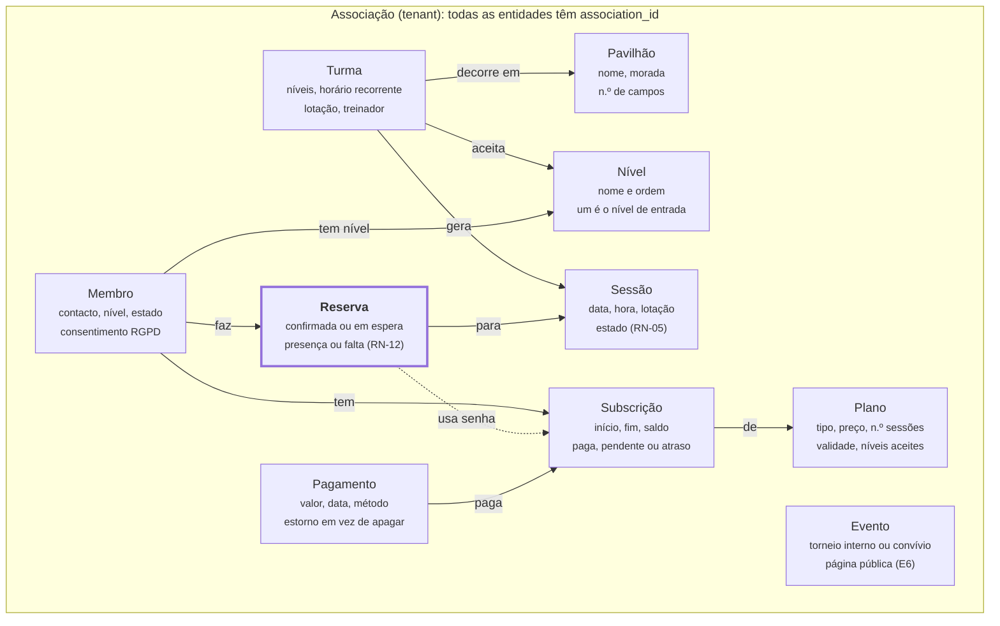
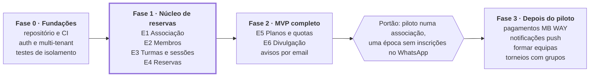

# RegiVolley — Visão e Requisitos

7/10/2026 · Mário Henrique

> Fonte de verdade para o âmbito do produto. Cada issue no GitHub refere a(s) história(s)
> (`US-xx`) e regra(s) de negócio (`RN-xx`) que implementa.

## Visão e problema

O RegiVolley é uma plataforma onde associações amadoras de voleibol de pavilhão gerem turmas
por nível e onde os membros reservam lugar, sessão a sessão, para treinar e jogar. Segue o
modelo do RegiBox (reserva de aulas em boxes de CrossFit), adaptado às necessidades do voleibol.

**Para quem:** associações e grupos amadores, não federados nem filiados, que organizam treinos
e jogo para adultos em turmas como Iniciante, Intermédio e Avançado.

**O problema hoje:**

- As inscrições fazem-se em grupos de WhatsApp e folhas de Excel: ninguém sabe ao certo quem
  vem, e as vagas perdem-se.
- As sessões ficam desequilibradas: ou há 9 pessoas para um campo, ou 20.
- Quotas e senhas são controladas à mão, sem registo claro de quem pagou ou quantas sessões
  ainda tem.
- Os torneios e convívios são divulgados só no círculo de cada associação.

**A proposta:** cada membro vê as sessões abertas para o seu nível, reserva lugar e entra em
lista de espera se estiver cheio. O treinador sabe quem vem e o administrador controla planos e
pagamentos num só sítio.

**Sucesso no MVP:** uma associação piloto deixa de usar o WhatsApp para inscrições durante uma
época completa.

## Âmbito do MVP

O MVP cobre a reserva sessão a sessão e o controlo manual de pagamentos para voleibol de
pavilhão; tudo o resto fica para fases seguintes.

| Dentro do MVP | Fora do MVP |
|---|---|
| Registo de associações e pavilhões | Voleibol de praia |
| Níveis e turmas com horário recorrente | Escalões de formação e integração com a FPV |
| Geração de sessões a partir do horário | Pagamentos online (MB WAY, Multibanco, cartão) |
| Reserva sessão a sessão, com lista de espera | Faturação certificada pela AT |
| Cancelamento com prazo e registo de faltas | App nativa iOS/Android (o MVP é uma web app mobile-first) |
| Planos: mensal ilimitado, N por semana, pack de senhas, avulso | Estatísticas de jogo (pontos, serviços, receções) |
| Pagamentos marcados à mão pelo administrador | Torneios com sorteio de grupos e resultados ao vivo |
| Presenças marcadas pelo treinador | Chat entre membros |
| Listagem pública de eventos da associação | Uma pessoa em várias associações com conta única |
| Notificações por email | Notificações push |

## Personas e papéis

Há quatro papéis, sempre dentro de uma associação; uma pessoa pode ser treinador e membro ao
mesmo tempo.

- **Administrador:** dirigente voluntário que gere a associação à noite, pelo telemóvel. Quer
  saber quem pagou e ter as turmas organizadas sem perder tempo.
- **Treinador:** orienta uma ou mais turmas. Quer saber quantos vêm antes de sair de casa e
  equipas equilibradas.
- **Membro:** adulto que joga por gosto, uma a três vezes por semana. Quer reservar em dois
  toques e saber se tem lugar.
- **Visitante:** pessoa sem conta que encontra a associação ou um evento e quer experimentar.

| Ação | Administrador | Treinador | Membro | Visitante |
|---|---|---|---|---|
| Configurar associação, pavilhões, níveis | Sim | Não | Não | Não |
| Criar turmas e horários | Sim | Não | Não | Não |
| Cancelar ou alterar uma sessão | Sim | Nas suas turmas | Não | Não |
| Aprovar membros e atribuir nível | Sim | Atribuir nível | Não | Não |
| Criar planos e registar pagamentos | Sim | Não | Não | Não |
| Marcar presenças | Sim | Nas suas turmas | Não | Não |
| Reservar e cancelar lugar | Sim | Sim | Sim | Não |
| Ver o próprio plano, saldo e histórico | Sim | Sim | Sim | Não |
| Pedir adesão a uma associação | Não | Não | Não | Sim |
| Ver página pública e eventos | Sim | Sim | Sim | Sim |

## Modelo de domínio

O núcleo é a **Reserva**: liga um Membro a uma Sessão e gasta saldo de uma Subscrição. Tudo o
resto existe para decidir se essa reserva é permitida.

Cada seta lê-se como frase: *Turma decorre em Pavilhão*. A seta tracejada indica que a
reserva gasta saldo da subscrição.

Cada entidade tem três modelos, como no task-manager-api: domínio, entidade JPA e DTO web.
Utilizadores e autenticação ficam fora do domínio, na infraestrutura; o domínio recebe apenas o
`memberId` e o `associationId`.

## Regras de negócio

As regras vivem no domínio (`Session`, `Booking`, `Subscription`) e não nos serviços, tal como
as transições de estado no task-manager-api. Os valores marcados como configuráveis são
definidos por associação; entre parênteses fica o valor por omissão.

### Sessões

- **RN-01** As sessões são geradas a partir do horário recorrente da turma, com uma janela
  configurável (4 semanas).
- **RN-02** A lotação é herdada da turma e pode ser alterada numa sessão concreta. Recomenda-se
  um múltiplo de 6 (12 = 2 equipas num campo); não é obrigatório. O treinador da sessão não
  conta para a lotação, mesmo quando joga (decidido a 7/10/2026).
- **RN-03** As reservas abrem um número configurável de dias antes (7) e fecham no início da
  sessão.
- **RN-04** Cancelar uma sessão cancela todas as reservas, devolve a senha consumida e notifica
  os inscritos.
- **RN-05** Estados da sessão: Agendada → Realizada, ou Agendada → Cancelada. Uma sessão
  realizada ou cancelada não volta atrás.

### Reservas

- **RN-06** Só reserva um membro ativo, com nível permitido na turma e com plano válido e saldo
  na data da sessão.
- **RN-07** Um membro tem no máximo uma reserva por sessão, e não pode ter duas sessões
  sobrepostas no tempo. *Uma reserva ativa por sessão: depois de cancelar, o membro pode voltar a
  reservar e entra no fim da fila.*
- **RN-08** Sessão cheia → o pedido entra na lista de espera, por ordem de chegada.
- **RN-09** Quando alguém cancela, o primeiro da lista de espera passa a confirmado
  automaticamente e é notificado, desde que ainda tenha saldo. Se não tiver, passa ao seguinte.
  *Se todos os membros em espera estiverem sem saldo, um lugar livre pode ser ocupado por um novo
  pedido; a lista de espera é reavaliada quando um membro em espera volta a ter saldo.*
- **RN-10** O cancelamento é gratuito até um prazo configurável (6 h antes). Depois do prazo, a
  reserva conta como usada e o lugar é libertado para a lista de espera. *A partir do início da
  sessão já não é possível cancelar a reserva (as presenças passam a ser marcadas pelo
  treinador). Cancelar uma reserva em espera é sempre gratuito.*
- **RN-11** Reservado e não presente = falta. Ao fim de um número configurável de faltas num mês
  (3), o membro fica impedido de reservar durante um período configurável (7 dias).
  **Decisão 7/10/2026:** por agora não há bloqueio — ao atingir o limite, o membro e o
  administrador recebem apenas um aviso. O bloqueio fica para uma fase seguinte.
- **RN-12** Estados da reserva: Em espera → Confirmada → Presente | Falta, e
  Em espera | Confirmada → Cancelada.

### Planos e saldo

- **RN-13** Tipos de plano: Mensal ilimitado; Mensal com N sessões por semana; Pack de N senhas
  com validade (ex.: 10 senhas, 90 dias); Sessão avulsa.
- **RN-14** Um plano pode limitar os níveis a que dá acesso (ex.: "Só Jogo Livre").
- **RN-15** A senha é consumida quando a reserva é confirmada e devolvida num cancelamento dentro
  do prazo ou num cancelamento da sessão.
- **RN-16** Um membro tem no máximo uma subscrição ativa por período. Uma renovação começa quando
  a anterior acaba.

### Pagamentos (manuais)

- **RN-17** O administrador regista um pagamento com valor, data, método (numerário,
  transferência, MB WAY) e a subscrição a que diz respeito.
- **RN-18** Uma subscrição pode estar Paga, Pendente ou Em atraso. A associação decide se um
  membro em atraso pode reservar. **Decisão 7/10/2026:** por agora um membro com a subscrição
  Em atraso **não pode reservar**; a reserva é recusada com o motivo.
- **RN-19** Um pagamento registado não se apaga: corrige-se com um estorno, para manter o
  histórico.

### Níveis

- **RN-20** Cada membro tem um nível, atribuído pelo treinador ou pelo administrador. Um membro
  novo começa no nível de entrada da associação.
- **RN-21** Uma turma aceita um ou mais níveis (ex.: Jogo Livre aceita Intermédio e Avançado).
  Por omissão, um membro pode reservar no seu nível e nos inferiores.

## Requisitos funcionais

São seis épicos, ordenados pela sequência de construção: cada um depende dos anteriores. Cada
história indica as regras de negócio que implementa.

### E1 · Associação

| ID | Como… | Quero… | Critérios de aceitação |
|---|---|---|---|
| US-01 | Visitante | Registar a minha associação | Nome, NIF opcional, localidade, email; quem regista fica administrador; o nome curto é único (usado no URL público) |
| US-02 | Administrador | Configurar pavilhões e campos | Nome, morada, n.º de campos; um pavilhão com turmas ativas não se apaga |
| US-03 | Administrador | Definir os níveis e a sua ordem | Pelo menos um nível; um é o nível de entrada (RN-20) |
| US-04 | Administrador | Convidar treinadores | Convite por email; o treinador escolhe as suas turmas |

### E2 · Membros

| ID | Como… | Quero… | Critérios de aceitação |
|---|---|---|---|
| US-05 | Visitante | Pedir adesão a uma associação | Nome, email, telemóvel, consentimento RGPD obrigatório; o pedido fica pendente |
| US-06 | Administrador | Aprovar ou recusar pedidos | Ao aprovar, o membro fica no nível de entrada e recebe email |
| US-07 | Treinador | Mudar o nível de um membro | Fica registado quem mudou e quando; aplica-se às reservas seguintes (RN-20) |
| US-08 | Administrador | Desativar um membro | As reservas futuras são canceladas; o histórico mantém-se |

### E3 · Turmas e sessões

| ID | Como… | Quero… | Critérios de aceitação |
|---|---|---|---|
| US-09 | Administrador | Criar uma turma com horário recorrente | Nome, níveis aceites, pavilhão, dia(s), hora, duração, lotação, treinador (RN-21) |
| US-10 | Sistema | Gerar as sessões das próximas semanas | Sem sessões duplicadas; respeita a janela (RN-01) |
| US-11 | Treinador | Cancelar uma sessão com motivo | Inscritos notificados, senhas devolvidas (RN-04) |
| US-12 | Treinador | Alterar a lotação de uma sessão | Baixar abaixo dos confirmados é recusado; subir promove a lista de espera (RN-02, RN-09) |

### E4 · Reservas

| ID | Como… | Quero… | Critérios de aceitação |
|---|---|---|---|
| US-13 | Membro | Ver as sessões da semana que posso reservar | Só turmas do meu nível; mostra vagas livres e lista de espera |
| US-14 | Membro | Reservar lugar | Confirmada se houver vaga, Em espera se cheia; recusada com motivo claro se faltar saldo, nível ou plano (RN-06 a RN-08) |
| US-15 | Membro | Cancelar a minha reserva | Antes do prazo devolve a senha; depois avisa que conta como usada (RN-10) |
| US-16 | Membro | Ser avisado quando subo da lista de espera | Email no momento da promoção (RN-09) |
| US-17 | Treinador | Ver a lista de confirmados e marcar presenças | Presente / Falta por pessoa; só a partir do início da sessão (RN-11) |
| US-18 | Membro | Ver o meu histórico e faltas | Últimos 3 meses; aviso se estiver perto do bloqueio |

### E5 · Planos e pagamentos

| ID | Como… | Quero… | Critérios de aceitação |
|---|---|---|---|
| US-19 | Administrador | Criar planos | Tipo, preço, n.º de sessões, validade, níveis permitidos (RN-13, RN-14) |
| US-20 | Administrador | Atribuir um plano a um membro | Cria uma subscrição com início e fim; recusa sobreposição (RN-16) |
| US-21 | Administrador | Registar um pagamento | Valor, data, método; a subscrição passa a Paga (RN-17) |
| US-22 | Administrador | Ver quem está em atraso | Lista filtrável por estado; exportação CSV (RN-18) |
| US-23 | Membro | Ver o meu plano e saldo | Sessões restantes, validade, estado de pagamento |

### E6 · Divulgação

| ID | Como… | Quero… | Critérios de aceitação |
|---|---|---|---|
| US-24 | Visitante | Ver a página pública da associação | Níveis, horários, pavilhões, contactos, botão "Quero experimentar" |
| US-25 | Administrador | Publicar um evento (torneio interno, convívio) | Título, data, local, descrição, inscrição externa por link ou email |
| US-26 | Visitante | Procurar eventos por distrito e data | Listagem pública de todas as associações |

## Requisitos não funcionais

Como há dados pessoais e várias associações no mesmo sistema, o RGPD e o isolamento entre
associações são requisitos do MVP, não melhorias futuras.

| Área | Requisito |
|---|---|
| Multi-tenant | Uma base de dados partilhada, com `association_id` em todas as tabelas de negócio; nenhuma consulta devolve dados de outra associação; testes de isolamento obrigatórios |
| RGPD | Consentimento explícito na adesão; exportação e apagamento dos dados a pedido (com anonimização do histórico de presenças e pagamentos); recolha só dos dados necessários; alojamento na UE |
| Autenticação | Email + palavra-passe ou link mágico; sessões com JWT ou cookie seguro; papéis verificados no servidor em cada pedido |
| Concorrência | A última vaga não pode ser atribuída a duas pessoas: bloqueio otimista ou restrição na base de dados, com teste de reservas simultâneas |
| Desempenho | A lista de sessões da semana responde em menos de 500 ms (p95) para uma associação com 300 membros |
| Usabilidade | Web app mobile-first (PWA); reservar em 2 toques a partir do ecrã inicial; inglês por omissão (decidido a 7/10/2026), preparada para tradução |
| Fuso horário | Datas guardadas em UTC, mostradas em Europe/Lisbon (incluindo mudanças de hora) |
| Qualidade | Mesma base do task-manager-api: Java 21, Spring Boot, onion architecture validada por JUnit 5, TDD, Testcontainers com PostgreSQL, JaCoCo ≥ 85% |
| Operação | Deploy em contentor; backups diários da base de dados; logs sem dados pessoais |

## Roadmap e questões em aberto

O MVP fica completo na Fase 2. A Fase 3 só começa depois de uma associação piloto usar a
plataforma durante uma época. As fases ainda não têm datas.

A Fase 1 é a prioridade: sem reservas fiáveis, nada mais tem valor.

> **Nota (7/10/2026):** a Fase 1 inclui também o modelo de Plano/Subscrição (issue #13),
> necessário para a regra de saldo das reservas (RN-06, RN-15). Autenticação (Fase 0) fica
> para depois da Fase 1.

### Questões em aberto

- [ ] Qual é a associação piloto, e quantos membros e turmas tem?
- [ ] Uma pessoa pode pertencer a várias associações com a mesma conta já no MVP?
- [x] O bloqueio por faltas (RN-11) é desejado, ou basta um aviso? **Por agora, só aviso** (7/10/2026).
- [x] Membros com pagamento em atraso podem reservar (RN-18)? **Não, por agora** (7/10/2026).
- [x] O treinador conta para a lotação quando também joga? **Não** — ver RN-02 (7/10/2026).
- [ ] Haverá uma sessão experimental gratuita para visitantes?
- [ ] Frontend: PWA em React/Next.js ou renderizado no servidor (Thymeleaf + HTMX)?
- [ ] Modelo de negócio: gratuito, mensalidade por associação ou valor por membro?
- [ ] Um membro promovido da lista de espera depois do prazo de cancelamento gratuito (RN-10)
  pode cancelar sem custo? *Por agora: não — conta como tardio.*
- [ ] Se uma sessão for cancelada (RN-04), uma reserva já cancelada tardiamente recebe a senha de
  volta? *Por agora: não.*
- [ ] Pode cancelar-se uma sessão depois de marcadas presenças? *Por agora: não.*
- [ ] Reservas confirmadas sem presença marcada passam a Falta quando a sessão é dada como
  realizada? *Por agora: não, ficam por marcar.*
